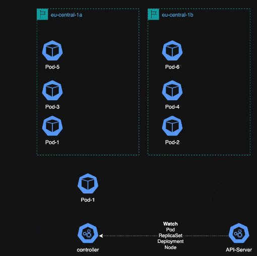

# pod-deletion-cost-controller

Controller for injecting `controller.kubernetes.io/pod-deletion-cost` annotation into running Pod. This annotation influences
which Pods are terminated first during downscaling. This allows the controller to make smarter decisions during scale-down and
avoid removing too many Pods from a single availability zone, which could compromise resilience.
In practice, by defining a deletion cost strategy across Pods, Kubernetes can evenly distribute termination events and maintain
high availability even under reduction of replicas. This results in balanced Pod placement across zones and a safer,
more predictable downscaling behavior. For more information, follow context below

- [replicaset/#pod-deletion-cost](https://kubernetes.io/docs/concepts/workloads/controllers/replicaset/#pod-deletion-cost)
- [k8s-algorithm-pick-pod-scale-in](https://rpadovani.com/k8s-algorithm-pick-pod-scale-in)
- [descheduler](https://github.com/kubernetes-sigs/descheduler?tab=readme-ov-file#removepodsviolatingtopologyspreadconstraint)
- [keps/sig-apps/2255-pod-cost](https://github.com/kubernetes/enhancements/tree/master/keps/sig-apps/2255-pod-cost)

# Usage & Configuration

Enable on k8s/Deployment via `pod-deletion-cost.lablabs.io/enabled: "true"` annotation:
```yaml
apiVersion: apps/v1
kind: Deployment
metadata:
  name: nginx
  labels:
    app: nginx
  annotations:
    pod-deletion-cost.lablabs.io/enabled: "true"
spec:
  replicas: 8
  selector:
    matchLabels:
      app: nginx
  template:
    metadata:
      labels:
        app: nginx
    spec:
      topologySpreadConstraints:
        - maxSkew: 1
          topologyKey: topology.kubernetes.io/zone
          whenUnsatisfiable: ScheduleAnyway
          labelSelector:
            matchLabels:
              app: nginx
      containers:
        - name: nginx
          image: nginx:latest
```

In default configuration, controller looks for node's label `topology.kubernetes.io/zone` and base on value
evenly distribute termination order via `controller.kubernetes.io/pod-deletion-cost`. In case Nodes are deployed
in no zone env, it can be overridden via `pod-deletion-cost.lablabs.io/spread-by` which define Label name of Node
used for spread topology counting logic.

```yaml
apiVersion: apps/v1
kind: Deployment
metadata:
  name: nginx
  labels:
    app: nginx
  annotations:
    pod-deletion-cost.lablabs.io/enabled: "true"
    pod-deletion-cost.lablabs.io/spread-by: "topology.kubernetes.io/rack" # Example of annotation, on-prem etc..
spec:
  replicas: 8
  selector:
    matchLabels:
      app: nginx
  template:
    metadata:
      labels:
        app: nginx
    spec:
      topologySpreadConstraints:
        - maxSkew: 1
          topologyKey: topology.kubernetes.io/rack
          whenUnsatisfiable: ScheduleAnyway
          labelSelector:
            matchLabels:
              app: nginx
      containers:
        - name: nginx
          image: nginx:latest
```

# Install

Helm install:
```bash
VERSION=v0.0.0-alpha.2
helm pull oci://ghcr.io/lablabs/pod-deletion-cost-controller/pod-deletion-cost-controller --version ${VERSION}
helm upgrade --install -n operations \
    --create-namespace pod-deletion-cost-controller  \
    oci://ghcr.io/lablabs/pod-deletion-cost-controller/pod-deletion-cost-controller \
    --version ${VERSION}
```

# How it works ?

Configuration of `controller.kubernetes.io/pod-deletion-cost` is based on following steps.

1. Controller watch for `pod-deletion-cost.lablabs.io/enabled: "true"` on Deployment and for Pod which is owned by ReplicaSet and Deployment. Pod -> is owned by -> RS -> is owned by -> Deployment
2. If Pod already contains `controller.kubernetes.io/pod-deletion-cost` skip
3. If not, find Node's zone (`topology.kubernetes.io/zone`) where Pod is scheduled,
4. List all Pods which belongs to the same zone `topology.kubernetes.io/zone`
5. Iterate over Pods from step 4 and create set of used `controller.kubernetes.io/pod-deletion-cost` values
6. Iterate over MaxInt32 up to zero and find first free value in set from step 5
7. Update this value into Pod came from Reconcile loop from step 3

Selection of algorithm is defined via `pod-deletion-cost.lablabs.io/type: "type_of_algorithm"`. In case you don't specify
type, default: `zone` is used:

```yaml
apiVersion: apps/v1
kind: Deployment
metadata:
  name: nginx
  labels:
    app: nginx
  annotations:
    pod-deletion-cost.lablabs.io/enabled: "true"
    pod-deletion-cost.lablabs.io/type: "zone"
```

> This configuration is mostly set up for future extension



### Add new algorithm

You can easily add new algorithm into controller. Take a look at [./internal/zone/module.go](./internal/zone/module.go)
```go
type Registrator interface {
    AddModule(module module.Handler) error
}

func Register(log logr.Logger, r Registrator, client client.Client, algoTypes []string) error {
    if slices.Contains(algoTypes, Name) || len(algoTypes) == 0 {
        h := NewHandler(client)
        err := r.AddModule(h)
        if err != nil {
            return fmt.Errorf("register zone module failed: %w", err)
        }
        log.WithValues("module", Name).Info("registered")
        return nil
    }
    log.V(2).WithValues("module", Name).Info("NOT registered")
    return nil
}
```

Registration of module is done in [./cmd/main.go](./cmd/main.go)
```go
//configuration part for algorithms
moduleMng := controller.NewModuleManager()
//Register new algo handler here
err = zone.Register(logger, moduleMng, mgr.GetClient(), algoType)
```

# Development & Tools

- [kubebuilder](https://book.kubebuilder.io) - generate project
- [mise](https://mise.jdx.dev/) - for all tools used by project

Dependencies:

- [Kind](https://kind.sigs.k8s.io/) - for running tests. It's not downloaded automatically as the other tools in bin folder

### [PRE-COMMIT](https://pre-commit.com/#install)

- install `pre-commit` binary if not installed by `mise`
- run `pre-commit install` to initialize pre-commit environment based on `.pre-commit-config.yaml` configuration

# Test

```bash
# Run unit tests
make test
# Run e2e tests with kind
make test-e2e
```
