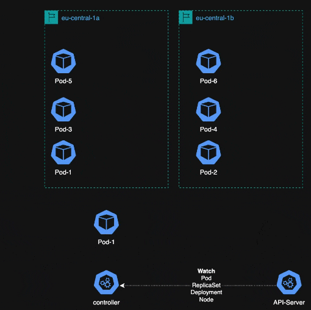

# Pod Deletion Cost Controller

A Kubernetes controller that automatically manages the [`controller.kubernetes.io/pod-deletion-cost`](https://kubernetes.io/docs/concepts/workloads/controllers/replicaset/#pod-deletion-cost) annotation on pods. This annotation influences which pods are terminated first during scale-down operations, enabling smarter and more resilient downscaling behavior.

The controller is designed to be **extensible** with a plugin-based architecture, allowing multiple algorithms for calculating pod deletion costs. It currently includes a **zone-aware distribution algorithm** that ensures even pod termination across availability zones, and an **age-ranking algorithm** that terminates the oldest pods first.

## The Problem: Default Kubernetes Scale-Down Behavior

When Kubernetes scales down a Deployment or ReplicaSet, it uses a [specific algorithm](https://github.com/kubernetes/kubernetes/blob/release-1.32/pkg/controller/replicaset/replica_set.go#L836) to determine which pods to delete first. The default selection criteria are:

1. Pods that are unassigned (not scheduled to a node)
2. Pods in Pending or Unknown phase
3. Pods not ready vs. pods ready
4. Pods with lower pod-deletion-cost annotation value
5. Pods with more recent creation timestamps
6. Random selection as a tiebreaker

**The issue:** Without explicit `pod-deletion-cost` annotations, Kubernetes may delete pods unevenly across availability zones during scale-down. This can lead to:

- **Imbalanced zone distribution** - One zone might lose significantly more pods than others
- **Reduced resilience** - Workloads become vulnerable to zone failures
- **Topology constraint violations** - Even with `topologySpreadConstraints`, scale-down doesn't respect zone distribution

For example, if you have 6 pods spread across 3 zones (2 per zone) and scale down to 3 pods, Kubernetes might delete 2 pods from Zone A and 1 from Zone B, leaving you with an unbalanced distribution (0 in Zone A, 1 in Zone B, 2 in Zone C).

## Solution: Pod Deletion Cost Annotation

Kubernetes provides the [`controller.kubernetes.io/pod-deletion-cost`](https://kubernetes.io/docs/concepts/workloads/controllers/replicaset/#pod-deletion-cost) annotation (stable since v1.22) to influence pod deletion order:

- **Lower values** = Higher deletion priority (deleted first)
- **Higher values** = Lower deletion priority (deleted last)
- Valid range: -2147483648 to 2147483647

This controller automatically assigns these values based on configurable algorithms, ensuring predictable and resilient scale-down behavior.

### References

- [Kubernetes ReplicaSet - Pod Deletion Cost](https://kubernetes.io/docs/concepts/workloads/controllers/replicaset/#pod-deletion-cost)
- [KEP-2255: Pod Deletion Cost](https://github.com/kubernetes/enhancements/tree/master/keps/sig-apps/2255-pod-cost)
- [Understanding K8s Scale-In Algorithm](https://rpadovani.com/k8s-algorithm-pick-pod-scale-in)
- [Descheduler - TopologySpreadConstraint](https://github.com/kubernetes-sigs/descheduler?tab=readme-ov-file#removepodsviolatingtopologyspreadconstraint)

## Algorithm: Zone-Aware Distribution (`zone`)

The `zone` algorithm (default) ensures even pod distribution across availability zones during scale-down.

### How It Works

1. **Pod Detection** - Controller watches for pods belonging to enabled Deployments
2. **Zone Identification** - Determines the pod's zone from its node's `topology.kubernetes.io/zone` label
3. **Cost Calculation** - Assigns unique deletion costs within each zone, starting from MaxInt32 (2147483647) and descending
4. **Annotation** - Applies `controller.kubernetes.io/pod-deletion-cost` to the pod

### Algorithm Details

Within each zone, pods receive descending cost values:
- First pod in zone: `2147483647` (most protected)
- Second pod in zone: `2147483646`
- And so on...

Different zones independently allocate their own cost values. This ensures that during scale-down, Kubernetes removes pods evenly across zones.

### Example Scenario

**Initial state:** 6 pods across 3 zones

```
Zone A: Pod1 (cost: 2147483647), Pod2 (cost: 2147483646)
Zone B: Pod3 (cost: 2147483647), Pod4 (cost: 2147483646)
Zone C: Pod5 (cost: 2147483647), Pod6 (cost: 2147483646)
```

**After scaling down to 3 pods:**

Kubernetes deletes pods with the lowest costs first. Since each zone has pods with cost `2147483646`, one pod is removed from each zone:

```
Zone A: Pod1 (cost: 2147483647)
Zone B: Pod3 (cost: 2147483647)
Zone C: Pod5 (cost: 2147483647)
```

Result: **Even distribution maintained** across all zones.



## Algorithm: Age Ranking (`timestamp-rank`)

The `timestamp-rank` algorithm makes scale-down drain the **oldest** pods of a ReplicaSet first, so routine scaling gradually refreshes a fleet instead of keeping long-lived pods around indefinitely.

### How It Works

1. **Pod Detection** - Controller watches for pods belonging to enabled Deployments
2. **ReplicaSet Listing** - Loads every pod of the reconciled pod's ReplicaSet
3. **Ranking** - Sorts the pods oldest-first by `creationTimestamp`, breaking ties by pod UID
4. **Cost Calculation** - Assigns each pod its 1-based position in that order (oldest = `1`)
5. **Annotation** - Patches only the pods whose current cost differs from their rank

Kubernetes deletes the lowest cost first, so among otherwise equal pods the oldest one is the next scale-down candidate. Cost is only the **fourth** criterion, after unassigned pods, phase and readiness — an unready newer pod is still shed before an older ready one.

### Example

Observed on a Deployment scaled `1 -> 11` in a single `kubectl scale`. Ten of the
eleven pods share one creation second, and every pod still gets a distinct cost:

```
POD                      CREATED                UID        COST
burst-849b5b8764-gfctj   2026-08-18T13:48:12Z   427e3d6a    1
burst-849b5b8764-ncj9n   2026-08-18T13:55:13Z   01a49754    2
burst-849b5b8764-rk79v   2026-08-18T13:55:13Z   2c00f93e    3
burst-849b5b8764-28rzw   2026-08-18T13:55:13Z   3dcd59d1    4
burst-849b5b8764-5mxmn   2026-08-18T13:55:13Z   41994745    5
burst-849b5b8764-d4b77   2026-08-18T13:55:13Z   586771fb    6
burst-849b5b8764-zp6xj   2026-08-18T13:55:13Z   62953543    7
burst-849b5b8764-qfbgm   2026-08-18T13:55:13Z   6a6acd22    8
burst-849b5b8764-ndm9z   2026-08-18T13:55:13Z   a43d05ea    9
burst-849b5b8764-wglzq   2026-08-18T13:55:13Z   aa89c985   10
burst-849b5b8764-98txr   2026-08-18T13:55:13Z   aca57995   11
```

(UIDs truncated.) Within the shared second the order follows UID ascending, so
*which* of those pods ranks lower is arbitrary but **stable** — the point is that
they are separated at all, and that the ordering does not change between
reconciles.

Scaling that Deployment back to 5 replicas deleted exactly the pods holding costs
`1`-`6` and kept `7`-`11`: highest deleted cost (`6`) below lowest surviving cost
(`7`), with no interleaving.

### Why Ranking Instead of an Absolute Age Cost

`creationTimestamp` is serialized as RFC3339 and therefore has **no sub-second component**. Any cost derived from a single pod's timestamp (for example `creationTimestamp - epoch`) gives **identical** values to all pods created within the same second, which is exactly what happens during a burst scale-out. Scaling a Deployment `1 -> 11` in a single `kubectl scale` produced 11 pods but only **4 distinct costs** under an absolute age cost, leaving Kubernetes to pick arbitrarily among the pods that tied.

Ranking pods against each other side-steps the resolution limit entirely and guarantees a unique cost per pod.

### Design Notes

- **Deterministic, so no expectations cache.** The cost is a pure function of the ReplicaSet's pod set ordered by `(creationTimestamp, UID)`. Every concurrent reconcile computes the same value for the same pod regardless of which pod triggered it, so patches are idempotent — unlike `zone`, which allocates from a shared descending pool and needs the expectations cache to avoid handing out duplicates. In the 11-pod burst above, all 11 pods enqueued a reconcile and each recomputed the full ranking, yet the controller issued exactly **11** patches rather than 11 x 11: every recomputation agreed, so the redundant writes were skipped.
- **Ranks start at 1.** A pod without the annotation is read as cost `0`, so 1-based ranks keep every ranked pod above the not-yet-ranked ones; a brand-new pod is shed before an already ranked, older pod.
- **Writes only on change.** Every `pod-deletion-cost` update re-triggers ReplicaSet reconciliation and [KEP-2255](https://github.com/kubernetes/enhancements/tree/master/keps/sig-apps/2255-pod-cost) cautions against frequent updates, so a converged reconcile issues no writes at all.
- **Scale-in re-compacts the ranks.** Because a cost is a pod's *position* in the age order, removing the oldest pods shifts everyone below them: a scale-in from 11 to 5 rewrites the five survivors from `7..11` to `1..5`. Relative order is preserved throughout, so this is cosmetic — but it costs one patch per surviving pod per scale-in, which is worth knowing for very large ReplicaSets. Leaving gaps instead would avoid the rewrite, at the price of needing a separate compaction step once later pods have to be ranked above sparse existing values. Scale-*out* is cheap by comparison: new pods are the youngest, so they append and no existing cost changes.
- **Terminating pods are excluded**, otherwise they would consume a rank and shift every younger pod.
- **Not-Ready pods are included**, which keeps ranks stable as pods become ready. Kubernetes compares phase and readiness before `pod-deletion-cost` anyway, so an unready pod is already preferred for deletion.

### Choosing Between the Algorithms

| Goal | Algorithm |
|---|---|
| Keep pods evenly spread across zones during scale-down | `zone` |
| Delete the oldest pods first to refresh a fleet through scaling | `timestamp-rank` |

Exactly **one** algorithm applies per Deployment — the `pod-deletion-cost.lablabs.io/type` annotation selects it, and the values are not combined.

```yaml
apiVersion: apps/v1
kind: Deployment
metadata:
  name: my-app
  annotations:
    pod-deletion-cost.lablabs.io/enabled: "true"
    pod-deletion-cost.lablabs.io/type: "timestamp-rank"
```

## Installation

### Helm

```bash
VERSION=v0.0.0-alpha.2

# Pull the chart (optional)
helm pull oci://ghcr.io/lablabs/pod-deletion-cost-controller/pod-deletion-cost-controller \
  --version ${VERSION}

# Install
helm upgrade --install pod-deletion-cost-controller \
  oci://ghcr.io/lablabs/pod-deletion-cost-controller/pod-deletion-cost-controller \
  --namespace operations \
  --create-namespace \
  --version ${VERSION}
```

### Helm Values

Key configuration options in `values.yaml`:

```yaml
# Algorithms to enable (which handlers are registered)
algorithms:
  - "zone"
  - "timestamp-rank"

# Logging configuration
log:
  devel: false
  encoder: console  # or "json"
  level: 3          # 0=debug, 1=info, 2=warn, 3=error

# Health probes
health:
  enabled: true
  port: 8001

# Metrics
metrics:
  enabled: true
  service:
    ports:
      metrics: 9000

# High availability
replicaCount: 1
pdb:
  enabled: false
  maxUnavailable: 1
```

## Usage

### Enable for a Deployment

Add the `pod-deletion-cost.lablabs.io/enabled: "true"` annotation to your Deployment:

```yaml
apiVersion: apps/v1
kind: Deployment
metadata:
  name: my-app
  annotations:
    pod-deletion-cost.lablabs.io/enabled: "true"
spec:
  replicas: 6
  selector:
    matchLabels:
      app: my-app
  template:
    metadata:
      labels:
        app: my-app
    spec:
      topologySpreadConstraints:
        - maxSkew: 1
          topologyKey: topology.kubernetes.io/zone
          whenUnsatisfiable: ScheduleAnyway
          labelSelector:
            matchLabels:
              app: my-app
      containers:
        - name: my-app
          image: my-app:latest
```

### Configuration Annotations

| Annotation | Required | Default | Description |
|-----------|----------|---------|-------------|
| `pod-deletion-cost.lablabs.io/enabled` | Yes | - | Set to `"true"` to enable the controller |
| `pod-deletion-cost.lablabs.io/type` | No | `zone` | Algorithm type to use: `zone` or `timestamp-rank` |
| `pod-deletion-cost.lablabs.io/spread-by` | No | `topology.kubernetes.io/zone` | Node label key for topology spreading (`zone` only) |

### Custom Topology Label

For on-premises or custom environments, you can specify a different node label for topology spreading:

```yaml
apiVersion: apps/v1
kind: Deployment
metadata:
  name: my-app
  annotations:
    pod-deletion-cost.lablabs.io/enabled: "true"
    pod-deletion-cost.lablabs.io/spread-by: "topology.kubernetes.io/rack"
spec:
  replicas: 6
  selector:
    matchLabels:
      app: my-app
  template:
    metadata:
      labels:
        app: my-app
    spec:
      topologySpreadConstraints:
        - maxSkew: 1
          topologyKey: topology.kubernetes.io/rack
          whenUnsatisfiable: ScheduleAnyway
          labelSelector:
            matchLabels:
              app: my-app
      containers:
        - name: my-app
          image: my-app:latest
```

### Explicit Algorithm Selection

`zone` applies when no `type` annotation is set, but it can also be requested explicitly:

```yaml
apiVersion: apps/v1
kind: Deployment
metadata:
  name: my-app
  annotations:
    pod-deletion-cost.lablabs.io/enabled: "true"
    pod-deletion-cost.lablabs.io/type: "zone"
```

### Annotations Written to Pods

| Annotation | Written by | Description |
|-----------|-----------|-------------|
| `controller.kubernetes.io/pod-deletion-cost` | all algorithms | The deletion cost consumed by Kubernetes |
| `pod-deletion-cost.lablabs.io/managed-by` | `timestamp-rank` | Records which algorithm produced the current cost, so a value left behind by another algorithm is recalculated when a Deployment switches `type` |

## Contributing

The controller uses an extensible plugin-based architecture, making it easy to add new algorithms for different use cases. We welcome contributions!

See [CONTRIBUTING.md](./CONTRIBUTING.md) for:

- Architecture overview and key components
- Step-by-step guide for adding new algorithms
- Development setup and build instructions
- Testing requirements
- Code style guidelines

## License

Apache License 2.0 - see [LICENSE](./LICENSE) for details.
